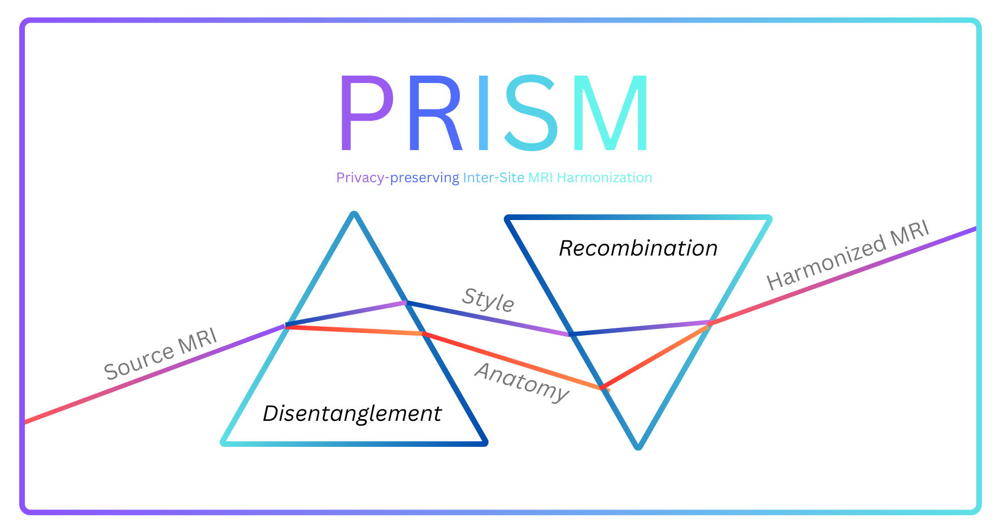

# PRISM: Privacy-preserving Inter-Site MRI Harmonization via Disentangled Representation Learning

- Paper: [arXiv](https://arxiv.org/abs/2411.06513)
- Cite:
  ```bibtex
  @misc{galada2024prismprivacypreservingintersitemri,
      title={PRISM: Privacy-preserving Inter-Site MRI Harmonization via Disentangled Representation Learning}, 
      author={Sarang Galada and Tanurima Halder and Kunal Deo and Ram P Krish and Kshitij Jadhav},
      year={2024},
      eprint={2411.06513},
      archivePrefix={arXiv},
      primaryClass={eess.IV},
      url={https://arxiv.org/abs/2411.06513},
  }
  ```
