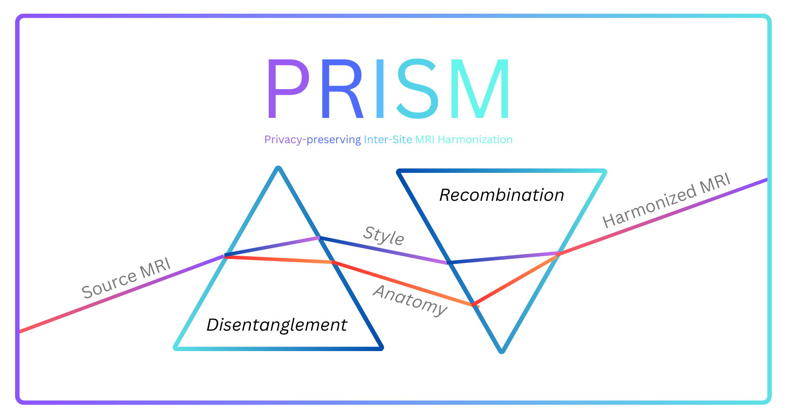
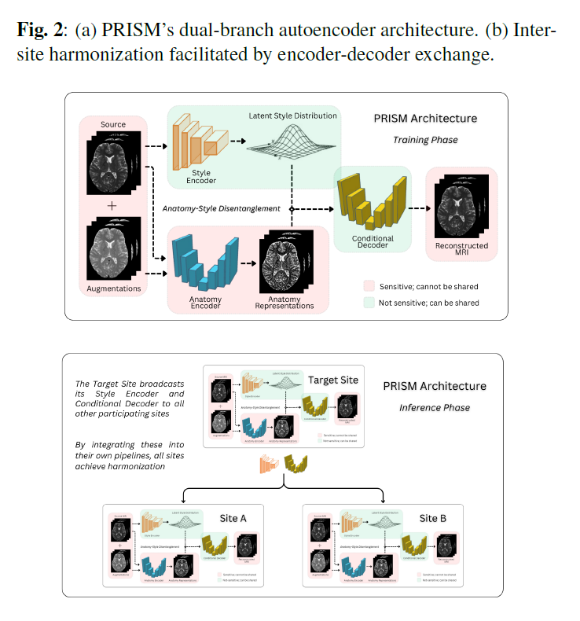
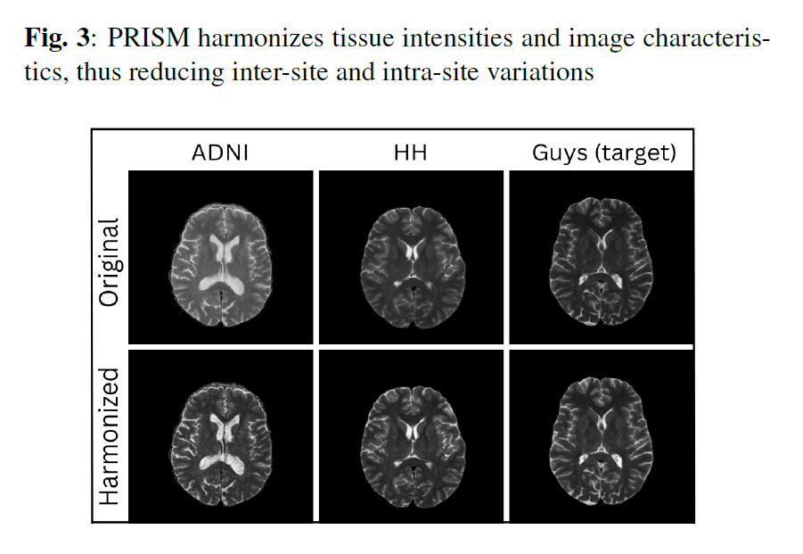
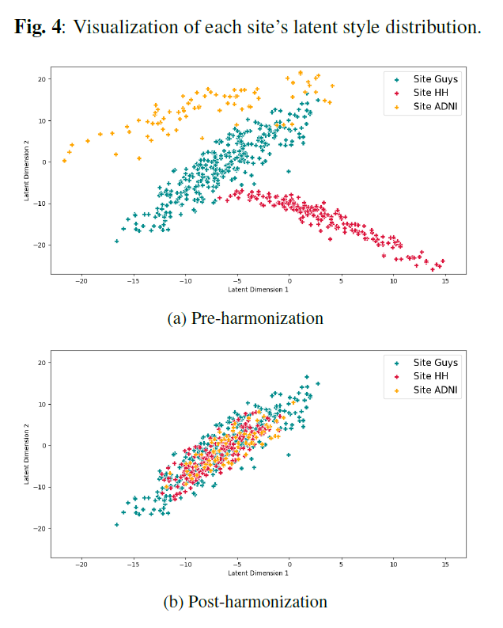

<p align="center">
  
</p>

## PRISM: Privacy-preserving Inter-Site MRI Harmonization via Disentangled Representation Learning

- Paper: [arXiv preprint](https://arxiv.org/abs/2411.06513) (_submitted to ISBI 2025_)
- Cite:
  ```bibtex
  @misc{galada2024prismprivacypreservingintersitemri,
      title={PRISM: Privacy-preserving Inter-Site MRI Harmonization via Disentangled Representation Learning}, 
      author={Sarang Galada and Tanurima Halder and Kunal Deo and Ram P Krish and Kshitij Jadhav},
      year={2024},
      eprint={2411.06513},
      archivePrefix={arXiv},
      primaryClass={eess.IV},
      url={https://arxiv.org/abs/2411.06513},
  }
  ```
---

### Usage:

1. Clone / download this repository, navigate to the [code](code/) folder and `pip install requirements.txt`
2. Skull strip your MRI volumes using `FreeSurfer` / `FSL` software (aka Brain extraction). [If you don't have MRI data, the openly available IXI Dataset is the easiest option.]
3. Run [MRI-Slicer.py](code/preprocessing/MRI-Slicer.py) on the stripped MRI volumes. [_Note: In some cases, where the MRI volumes are stored in different orientations, you may need to manually reorient the data_]
4. Run [folder2dataset.py](code/preprocessing/folder2dataset.py) to generate separate custom MRI datasets (incl. augmentations) for each site.
5. To train the PRISM model on each site, follow the [PRISM-training.ipynb](code/demo-notebooks/PRISM-training.ipynb) notebook. Alternatively, run [train.py](code/train.py). Repeat the training procedure for each participating site.
6. With the models now trained, follow the [PRISM-inference.ipynb](code/demo-notebooks/PRISM-inference.ipynb) notebook to harmonize the MRI without any data exchange, as per the `PRISM` framework. Alternatively, run [harmonize.py](code/harmonize.py).
   - [reconstruct.py](code/reconstruct.py) and [visualization.py](code/visualization.py) can be run to evaluate PRISM's reconstruction performance and visualize the "_style_" harmonization.

(_More coming soon_)

---

### Architecture:
<p align="center">
  
</p>

---

### Results:
<p align="center">
  
</p>

--

<p align="center">
  
</p>
